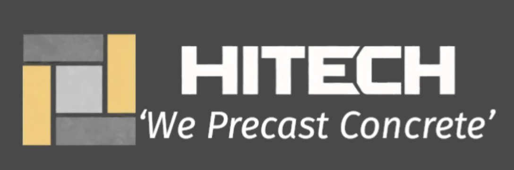

# Hitech Concrete Product - Official Website

A professional, full-stack business website for Hitech Concrete Product, a leading manufacturer of high-quality precast concrete products since 2004.



## 🏢 About

Hitech Concrete Product specializes in manufacturing, popularizing, and marketing high-quality precast concrete products through modern technology, stringent quality control, timely execution, and continuous research and development.

**Location**: Village Mohammadpur Chowki, Post Safedabad, Barabanki -225003, Uttar Pradesh, India

## ✨ Features

### Core Functionality
- **Product Catalog**: Comprehensive showcase of 7+ product categories
- **Contact Management**: Inquiry form with MongoDB database integration
- **Responsive Design**: Mobile-first design with Tailwind CSS
- **WhatsApp Integration**: Direct messaging via floating WhatsApp button
- **Google Maps Integration**: Direct location access
- **LinkedIn Integration**: Social media connectivity

### Product Pages
1. **Automatic Paver Blocks** - Manufactured using fully automatic machinery
2. **RCC Pipes (Hume Pipes)** - IS 458:2003 certified
3. **Rubbermold Paver Blocks** - Multiple shapes and colors
4. **Kerb Stones** - Durable and precisely molded
5. **Saucer and Drain Covers** - Efficient water management
6. **Manhole Covers** - Heavy-duty and durable
7. **Precast Boundary Walls** - Custom compound walls

### Additional Features
- Product specifications with detailed tables
- Onsite installation photo galleries
- Company timeline and journey
- Quality certifications showcase
- Multi-contact point support (2 phone numbers)

## 🛠️ Tech Stack

### Frontend
- **Framework**: React.js 18.x
- **Styling**: Tailwind CSS 3.x
- **Icons**: Lucide React
- **Routing**: React Router DOM v6
- **HTTP Client**: Axios
- **UI Components**: Custom components with Shadcn/ui

### Backend
- **Framework**: FastAPI (Python)
- **Database**: MongoDB
- **CORS**: FastAPI CORS Middleware
- **Motor**: Async MongoDB driver

### Development Tools
- **Package Manager**: Yarn
- **Code Quality**: ESLint
- **Build Tool**: Craco (Create React App Configuration Override)

## 📁 Project Structure

```
/app
├── backend/
│   ├── server.py              # FastAPI application
│   ├── requirements.txt       # Python dependencies
│   └── .env                   # Backend environment variables
├── frontend/
│   ├── public/
│   │   ├── hitech-logo.png
│   │   └── products/          # Product images
│   ├── src/
│   │   ├── components/
│   │   │   ├── Navbar.js
│   │   │   ├── Footer.js
│   │   │   └── WhatsAppButton.js
│   │   ├── pages/
│   │   │   ├── HomePage.js
│   │   │   ├── AboutPage.js
│   │   │   ├── ContactPage.js
│   │   │   ├── ProductsPage.js
│   │   │   └── products/      # Individual product pages
│   │   ├── App.js
│   │   └── index.js
│   ├── package.json
│   └── .env                   # Frontend environment variables
├── memory/                    # Documentation and credentials
└── README.md
```

## 🚀 Getting Started

### Prerequisites
- Node.js (v16 or higher)
- Python 3.8+
- MongoDB instance
- Yarn package manager

### Installation

1. **Clone the repository**
```bash
git clone <repository-url>
cd app
```

2. **Backend Setup**
```bash
cd backend

# Create virtual environment
python -m venv venv
source venv/bin/activate  # On Windows: venv\Scripts\activate

# Install dependencies
pip install -r requirements.txt

# Create .env file with:
# MONGO_URL=<your-mongodb-url>
# DB_NAME=hitech_concrete
```

3. **Frontend Setup**
```bash
cd frontend

# Install dependencies
yarn install

# Create .env file with:
# REACT_APP_BACKEND_URL=<your-backend-url>
```

### Running the Application

**Development Mode:**

1. **Start Backend** (Terminal 1)
```bash
cd backend
uvicorn server:app --reload --host 0.0.0.0 --port 8001
```

2. **Start Frontend** (Terminal 2)
```bash
cd frontend
yarn start
```

The application will be available at:
- Frontend: `http://localhost:3000`
- Backend API: `http://localhost:8001`

## 🔧 Environment Variables

### Backend (.env)
```env
MONGO_URL=mongodb://localhost:27017
DB_NAME=hitech_concrete
```

### Frontend (.env)
```env
REACT_APP_BACKEND_URL=http://localhost:8001
```

## 📡 API Endpoints

### Inquiries Management

#### Submit New Inquiry
```http
POST /api/inquiries
Content-Type: application/json

{
  "name": "John Doe",
  "email": "john@example.com",
  "phone": "+91-XXXXXXXXXX",
  "product_interest": "Automatic Paver Blocks",
  "message": "Interested in bulk order"
}
```

#### Get All Inquiries
```http
GET /api/inquiries
```

Response:
```json
[
  {
    "id": "uuid",
    "name": "John Doe",
    "email": "john@example.com",
    "phone": "+91-XXXXXXXXXX",
    "product_interest": "Automatic Paver Blocks",
    "message": "Interested in bulk order",
    "timestamp": "2026-04-17T08:00:00Z",
    "status": "new"
  }
]
```

## 🗄️ Database Schema

### inquiries Collection
```javascript
{
  id: String (UUID),
  name: String,
  email: String,
  phone: String,
  product_interest: String,
  message: String,
  timestamp: DateTime,
  status: String (default: "new")
}
```

## 🎨 Design System

### Color Palette
- **Primary**: Yellow (#EAB308 - yellow-500)
- **Secondary**: Gray-900 (#111827)
- **Accent**: Yellow-400 (#FACC15)
- **Background**: White, Gray-50
- **Text**: Gray-700, Gray-900

### Typography
- **Font Family**: System fonts (sans-serif)
- **H1**: text-5xl md:text-6xl
- **H2**: text-4xl
- **Body**: text-base
- **Small**: text-sm

## 📞 Contact Information

- **Phone**: 
  - Primary: +91 9839001970
  - Secondary: +91 6390164990
- **Email**: hitecht09@gmail.com
- **WhatsApp**: +91 6390164990
- **Address**: Hitech Concrete Product, Village Mohammadpur Chowki, Post Safedabad, Barabanki -225003
- **Google Maps**: [View Location](https://www.google.com/maps/place/Hitech+Concrete+Product/@26.9003149,81.0958083,888m/)
- **LinkedIn**: [Hitech Concrete Product](https://www.linkedin.com/company/hitech-concrete-product/?originalSubdomain=in)

## 🏆 Certifications & Standards

- **IS 458:2003** - RCC Pipes Certified
- **IS Standards** - Paver Blocks Compliant
- **Quality Assured** - Stringent Testing

## 📅 Company Milestones

- **2004**: Hitech Concrete Product established
- **2005**: IS 458:2003 certification achieved for RCC Pipes
- **2015**: Expanded product range to 8+ categories
- **2017**: Installed fully automatic vertical casting plant for RCC pipes
- **2024**: Served 500+ satisfied clients across India
- **2025**: Installed fully automatic paver block plant
- **2026**: Continuing innovation and growth in precast concrete technology

## 🚢 Deployment

### Production Build

**Frontend:**
```bash
cd frontend
yarn build
```

**Backend:**
```bash
cd backend
# Ensure all environment variables are set
python server.py
```

### Deployment Platforms
- **Frontend**: Vercel, Netlify, Emergent
- **Backend**: Railway, Render, Emergent
- **Database**: MongoDB Atlas (recommended)

### Environment Variables for Production
- Update `REACT_APP_BACKEND_URL` to production backend URL
- Update `MONGO_URL` to MongoDB Atlas connection string
- Ensure CORS settings allow production frontend domain

## 🧪 Testing

The application uses Playwright for E2E testing.

```bash
# Run tests
pytest

# Run specific test
pytest tests/test_contact.py
```

## 📝 Development Guidelines

### Code Style
- Use functional components with hooks
- Follow ESLint configuration
- Use Tailwind CSS for styling
- Keep components modular and reusable

### Git Workflow
- Main branch: `main`
- Feature branches: `feature/feature-name`
- Bug fixes: `bugfix/issue-description`

### Commit Messages
```
feat: Add new product page
fix: Resolve contact form validation
docs: Update README
style: Format code
refactor: Optimize image loading
```

## 🤝 Contributing

1. Fork the repository
2. Create your feature branch (`git checkout -b feature/AmazingFeature`)
3. Commit your changes (`git commit -m 'Add some AmazingFeature'`)
4. Push to the branch (`git push origin feature/AmazingFeature`)
5. Open a Pull Request

## 📄 License

Copyright © 2026 Hitech Concrete Product. All rights reserved.

## 🙏 Acknowledgments

- Built with [React](https://reactjs.org/)
- Styled with [Tailwind CSS](https://tailwindcss.com/)
- Backend powered by [FastAPI](https://fastapi.tiangolo.com/)
- Icons by [Lucide](https://lucide.dev/)

## 📧 Support

For support or business inquiries:
- Email: hitecht09@gmail.com
- Phone: +91 9839001970 / +91 6390164990
- Website: [Contact Form](http://localhost:3000/contact)

---

**Hitech Concrete Product** - *We Precast Concrete*

*Manufacturing excellence since 2004*
